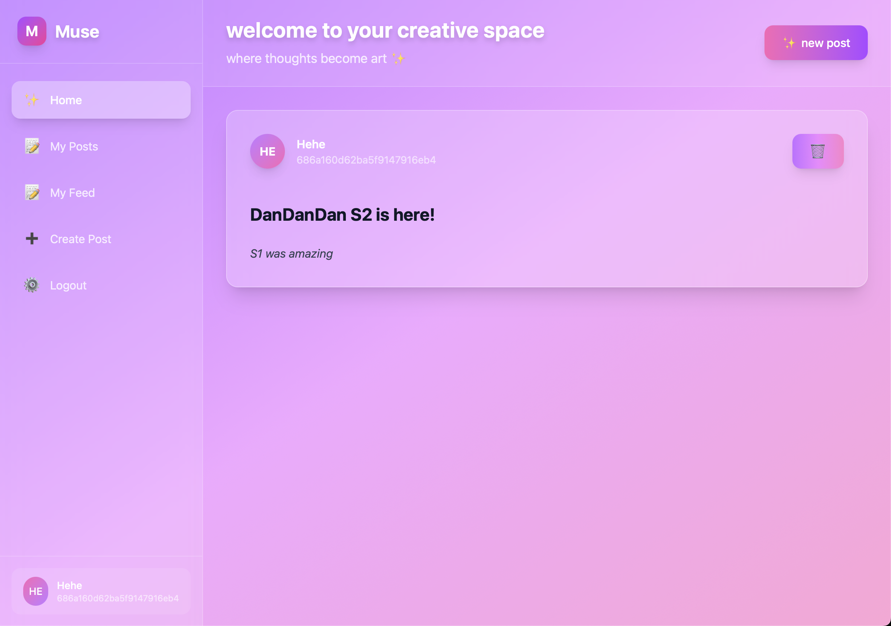
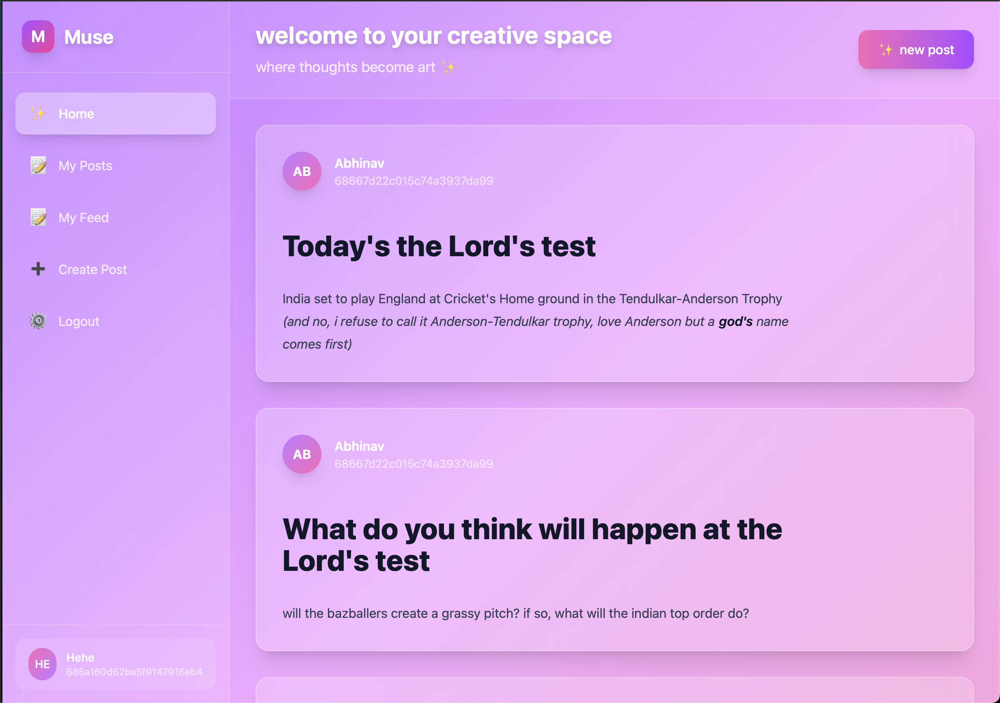
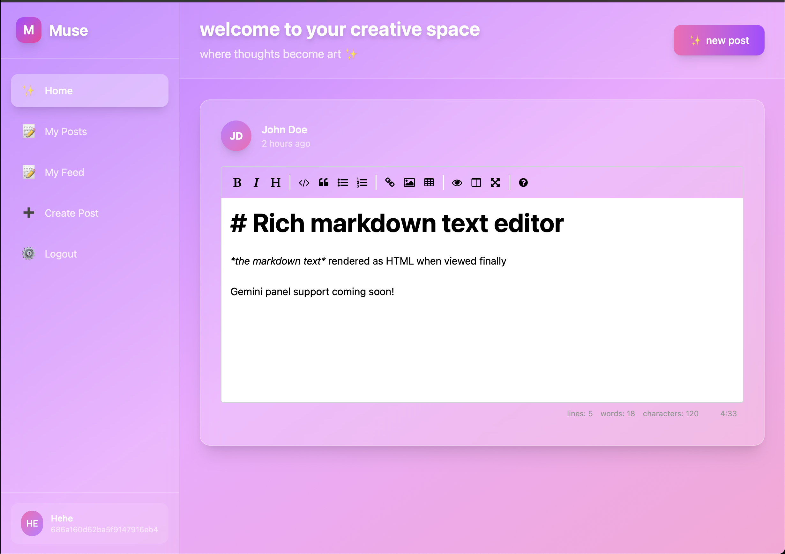

# Muse

> *Intuitive, cross‑platform Markdown note‑taking.* Built with **Blazor Server** and **TypeScript/Node.js**.

## Table of Contents

1. [Key Features](#key-features)
2. [View Screenshots](#screenshots)
3. [Roadmap](#roadmap)
4. [Tech Stack](#tech-stack)
5. [Repository Structure](#repository-structure)
6. [Getting Started](#getting-started)
   1. [Prerequisites](#prerequisites)
   2. [Local development](#local-development)
7. [Configuration](#configuration)
8. [Code Style & Conventions](#code-style--conventions)

---

## Key Features

| Status | Feature                                                              |
| ------ | -------------------------------------------------------------------- |
| ✅      | **Authentication:** Sign‑up / log‑in with username + password       |
| ✅      | **Rich Markdown editor:** Real‑time preview with rich‑text shortcuts|
| ✅      | **Beautiful, Responsive UI:** Mobile‑first layouts, TailwindCSS     |
| ✅      | **Feed views**: All‑posts & per‑user feeds, Markdown → HTML renderer|
| 🔄     | **Gemini integration:** AI‑powered note assistance                   |
| 🔄     | **Profile editing:** Update bio, avatar, preferences                 |
| 🔄     | **Enhanced sign‑up:** Collect additional profile fields              |
| 🔄     | **UI QoL:** Dark‑mode toggle, accessibility improvements             |
| 🔄     | **Database switch:** Migrating MongoDB → PostgreSQL                  |

> **Version v0.1** is considered a *beta* release. Expect breaking changes until v1.0.

- The Frontend is hosted on [azure webapps](https://muse-frontend.azurewebsites.net/).
- The Backend is hosted on [render](https://muse-0f55.onrender.com/).

---

## Screenshots

<details>
  <summary>The title of the image group</summary>
  
  
  
</details>

---

## Roadmap

* **v0.2** – AI-draft helper using Gemini panel
* **v0.3** – Better Signup Page with more user-relevant info
* **v0.4** – Postgres migration from MongoDB
* **v1.0** – UI QoL

---

## Tech Stack

| Layer              | Tech                                                                          |
| ------------------ | ----------------------------------------------------------------------------- |
| Frontend           | Blazor Server (.NET 9)                                                        |
| Backend API        | Node.js 22, Express 5, TypeScript                                             |
| Database (current) | MongoDB Atlas                                                                 |
| Incoming           | PostgreSQL w/ Prisma ORM                                                      |
| Auth               | JWT + Access + Refresh tokens                                                 |
| Dev ops            | Azure WebApps + GitHub Actions(Frontend), Render (Backend)                    |

---

## Repository Structure

```
Muse/
|-- MuseBackend/                     # Node.js + Express backend
|   |-- src/
|   |   |-- Controllers/            # Request handlers (auth, notes, etc.)
|   |   |-- Repositories/          # DB logic, abstracted Mongo ops (switchable to Prisma later)
|   |   |-- Router/                # Combines routes + middleware per module
|   |   |-- Main.ts                # Entry point – sets up server and middlewares
|   |
|   |-- .gitignore
|   |-- package-lock.json
|   |-- package.json
|   |-- tsconfig.json
|
|-- MuseFrontend/                   # Blazor Server frontend
|   |-- Components/                # Reusable UI pieces (editor, nav, etc.)
|   |-- Models/                    # C# types shared across pages and services
|   |-- Properties/                # Blazor config, launch settings etc.
|   |-- Services/                  # ApiService layer (AuthService, ContentService)
|   |-- Styles/                    # Tailwind + maybe any custom CSS?
|   |-- wwwroot/                   # Static assets like icons, fonts, JS helpers
|   |
|   |-- .gitignore
|   |-- MuseFrontend.csproj
|   |-- Program.cs                 # Bootstraps the Blazor app, DI container
```

---

## Getting Started

### Prerequisites

* **.NET 9 SDK** (or newer) → [https://dotnet.microsoft.com/download](https://dotnet.microsoft.com/download)
* **Node.js 22+** & **npm 10+** → [https://nodejs.org](https://nodejs.org)
* **Git**

### Local Development

```bash
# 1 / Clone
$ git clone https://github.com/your‑org/Muse.git && cd Muse

# 2 / Backend Environment Variables
$ cd MuseBackend
$ touch .env

> See table below for env variables to define

# 3 / Run Backend
$ npm i
$ npx tsc
$ npm dist/Main.js      # starts the backend on port 4321

# 4 / Fronten
$ cd ../MuseFrontend
$ dotnet watch                    # hot‑reload on :5076

# 5 / Visit
open http://localhost:5076
```
---

## Configuration


| Variable               | Description                           | Example / Default                                     |
| ---------------------- | ------------------------------------- | ----------------------------------------------------- |
| `ACCESS_TOKEN_SECRET`  | Secret key for signing access tokens  | `12345678910`                                         |
| `REFRESH_TOKEN_SECRET` | Secret key for signing refresh tokens | `12345678910`                                         |
| `MONGO_URL`            | Connection URI for MongoDB            | `mongodb+srv://<user>:<pass>@cluster.mongodb.net/...` |

---

## Code Style & Conventions

### TypeScript / Node.js (Backend)

* **ES2020** syntax
* 2‑space indentation
* \[Prettier] enforced – see `package.json` scripts
* In classes, private members ***MUST*** be prefixed by an **underscore(_)**;

### C# / Blazor (Frontend)

- Microsoft's C# guidelines, except:
    - All control flow must always have a brace, and may only omit a brace if only followed by a single short return statement.
    - All lines must be 120 columns or shorter.
---

## License

Distributed under the **MIT License**.

---
